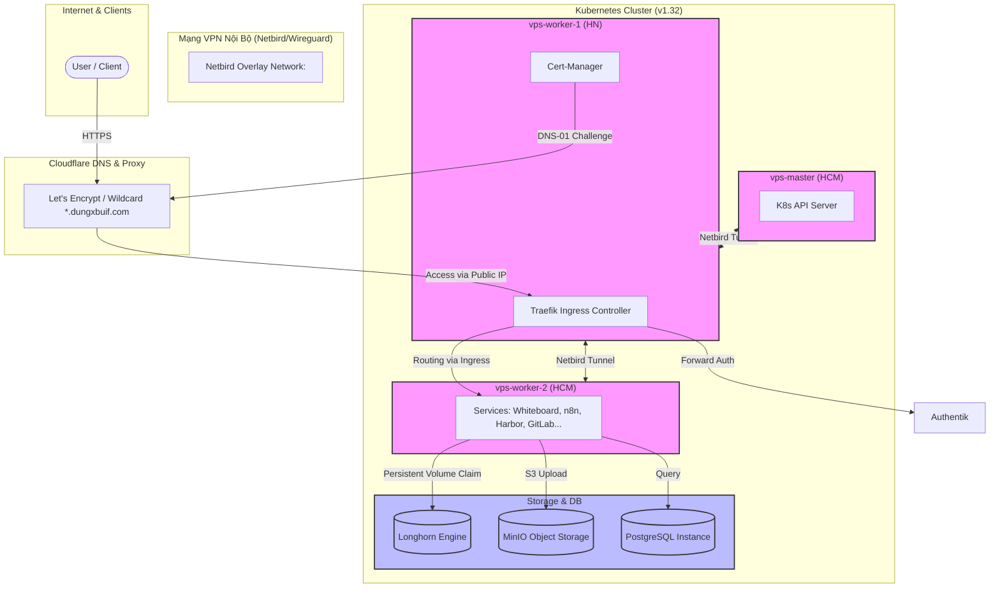

# Hệ Thống Self-Host Homelab (Legacy v1)

Tài liệu này cung cấp cái nhìn tổng quan về kiến trúc, topo mạng, trạng thái hiện tại và hướng dẫn vận hành hệ thống self-host cũ (legacy version) phục vụ cho nhu cầu lưu trữ và chạy ứng dụng cá nhân.

---

## 📌 Tổng Quan Hệ Thống (System Overview)

Hệ thống được thiết kế theo mô hình lai (Hybrid), chuyển dịch từ các dịch vụ chạy độc lập bằng **Docker Compose (vps-v1)** sang cụm **Kubernetes Cluster (kubernetes-v1)** tự quản trị, sử dụng giải pháp VPN nội bộ (**Netbird/Wireguard**) để kết nối các node nằm ở các data center khác nhau (HCM và HN) và quản lý lưu trữ phân tán (**Longhorn**).

### Các thành phần cốt lõi:
*   **Container Orchestration**: Kubernetes (v1.32) & Docker Compose.
*   **Networking & Security**: Cilium CNI, Traefik Ingress Controller, Cert-manager (cấp chứng chỉ Let's Encrypt qua Cloudflare DNS challenge), Authentik (Xác thực tập trung/Forward Auth).
*   **Storage**: Longhorn (Block Storage phân tán), MinIO (S3-compatible Object Storage).
*   **CI/CD & Registry**: GitLab (internal), Harbor (Private Registry), ArgoCD (GitOps).
*   **Ứng dụng cốt lõi**: Whiteboard (Excalidraw custom FE/BE/WS), n8n (Automation), pgAdmin, CoTurn.

---

## 🏗️ Sơ Đồ Topology Hệ Thống



---

## 📊 Hiện Trạng Hệ Thống (Current State)

### 1. Thông Tin Tài Nguyên Máy Chủ
| Tên Server | Số CPU | RAM | Dung Lượng | IP Public | Hệ Điều Hành | Vị Trí / Vai Trò |
| :--- | :---: | :---: | :---: | :--- | :--- | :--- |
| **vps-master** | 4 Cores | 8 GB | 20 GB | `<MASTER_VPS_PUBLIC_IP>` | CentOS 7.9 | Control Plane (HCM) |
| **vps-worker-1** | 4 Cores | 8 GB | 20 GB | `<VPS_PUBLIC_IP>` | Ubuntu 22.04 | Workload / Ingress Node (HN) |
| **vps-worker-2** | 1 Core | 2 GB | 40 GB | `<WORKER2_VPS_PUBLIC_IP>` | Ubuntu 22.04 | Gateway & VPN Management (HCM) |

> [!NOTE]
> Hệ thống sử dụng mạng **Netbird** với Management URL đặt tại `https://nccquynhon.edu.vn` để thiết lập VPN mesh giữa các Cloud VPS.

### 2. Trạng Thái Vận Hành & Khắc Phục Sự Cố Gần Nhất
*   **Kubernetes Certificates**: Đã thực hiện gia hạn toàn bộ chứng chỉ nội bộ của cụm K8s vào ngày **19/01/2026** (hiệu lực đến **19/01/2027**).
*   **Lưu Trữ Phân Tán (Longhorn)**: Số node thực tế hoạt động thay đổi dẫn đến lỗi `ReplicaSchedulingFailure`. Trạng thái đã được xử lý ổn định bằng cách cấu hình giảm số lượng replica mong muốn từ **3 xuống 2** để phù hợp với quy mô cluster hiện tại.
*   **Quản Lý SSL/TLS**: 
    *   Sử dụng cơ chế Wildcard Certificate cho domain chính `*.dungxbuif.com`.
    *   Đã nâng cấu hình gia hạn chứng chỉ an toàn lên **30 ngày trước khi hết hạn** (`renewBefore: 720h`) và kích hoạt tự động xoay vòng khóa riêng tư (`rotationPolicy: Always`).
    *   Hạ tầng đã sẵn sàng để tích hợp thêm các External Domains độc lập (sử dụng template có sẵn trong thư mục [external-domains](./kubernetes-v1/certmanager/external-domains)).

---

## 📁 Cấu Trúc Thư Mục Dự Án (Directory Structure)

*   [docker/](./docker): Cấu hình chạy các ứng dụng độc lập qua Docker Compose (GitLab, PostgreSQL...).
*   [docs/](./docs): Tài liệu hướng dẫn thiết lập hệ thống, bao gồm các tệp cấu hình Proxmox, Netbird, Wireguard và kiến trúc K8s.
*   [kubernetes-v1/](./kubernetes-v1): Toàn bộ Manifests triển khai trên Kubernetes:
    *   `argocd/`: Quản lý GitOps deploy.
    *   `traefik/` & `certmanager/`: Cấu hình Ingress và chứng chỉ SSL/TLS.
    *   `authentik/`: Nền tảng Identity Provider (IdP) & SSO.
    *   `harbor/`: Private Container Registry.
    *   `whiteboard/`: Ứng dụng vẽ bảng nhóm tự build (Excalidraw wrapper).
    *   `storages/`: Cấu hình StorageClass và phân bổ lưu trữ.
*   [vps-v1/](./vps-v1): Các stack chạy trực tiếp bằng Docker trên VPS độc lập đứng sau Traefik Proxy.

---

## 🚀 Hướng Dẫn Triển Khai Một Số Dịch Vụ Tiêu Biểu

### 1. Triển Khai n8n (Automation Tool)

#### Cách 1: Chạy nhanh bằng Docker
```bash
docker volume create n8n_data

docker run -it --rm \
 --name n8n \
 -p 5678:5678 \
 -e DB_TYPE=postgresdb \
 -e DB_POSTGRESDB_DATABASE=<POSTGRES_DATABASE> \
 -e DB_POSTGRESDB_HOST=<POSTGRES_HOST> \
 -e DB_POSTGRESDB_PORT=<POSTGRES_PORT> \
 -e DB_POSTGRESDB_USER=<POSTGRES_USER> \
 -e DB_POSTGRESDB_SCHEMA=<POSTGRES_SCHEMA> \
 -e DB_POSTGRESDB_PASSWORD=<POSTGRES_PASSWORD> \
 -v n8n_data:/home/node/.n8n \
 docker.n8n.io/n8nio/n8n
```

#### Cách 2: Triển khai trên Kubernetes Cluster
Áp dụng toàn bộ manifests trong thư mục n8n:
```bash
kubectl apply -f /root/selfhost/n8n/
```
*   **Các thành phần bao gồm**: `namespace`, `deployment`, `service` (port 80), `pvc` cho n8n data, `ingress` (`n8n.dungxbuif.com`), và PostgreSQL Database đính kèm (`postgres-deployment`, `postgres-configmap`, `postgres-pvc`).
*   **Địa chỉ truy cập**: `http://n8n.dungxbuif.com` (hoặc HTTPS thông qua Traefik Ingress).
