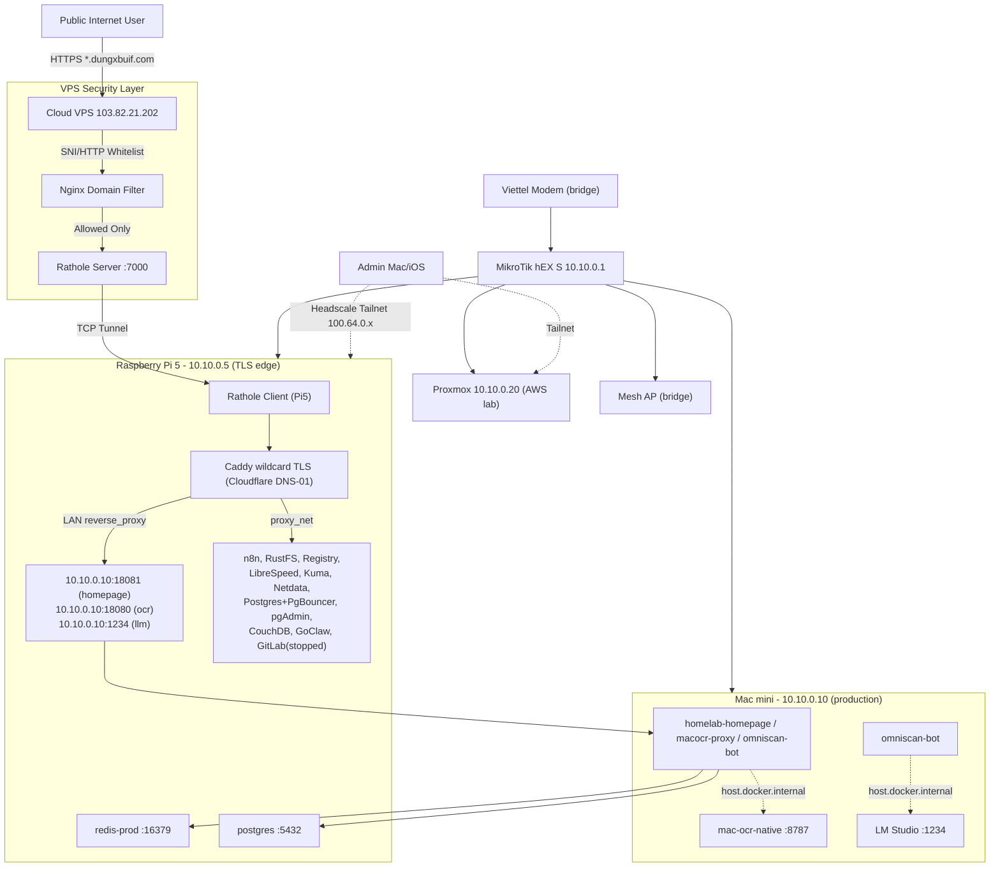

# 🏠 HOMELAB SYSTEM CONTEXT & AI AGENT PLAYBOOK

> This document is the absolute source of truth (System Context & Runbooks) for
> managing, debugging, and provisioning the Homelab Infrastructure (v3 —
> Mac-centric production). Read it before executing commands or changing config.
>
> **Architecture version:** v3 (2026-08). User-facing workloads run on the
> **Mac mini** (`10.10.0.10`); the **Pi5** (`10.10.0.5`) is the TLS edge, DB, and
> object storage; the **Cloud VPS** (`103.82.21.202`) is the public boundary;
> the **Proxmox** host (`10.10.0.20`) is now an AWS practice lab. The 3-node K8s
> cluster was retired and its docs archived — see [`archived/k8s-v2/`](./archived/k8s-v2/).

---

## 🗺️ System Topology & Network Architecture

The homelab is a hybrid of a cloud boundary (VPS), a home gateway/edge (Pi5),
a production compute node (Mac mini), and a lab hypervisor (Proxmox), linked by
a Headscale Tailnet mesh (WireGuard overlay).

### 0. ASCII Topology Snapshot

```text
External users
    |
    | HTTPS: *.dungxbuif.com  (Cloudflare DNS -> VPS public IP)
    v
+----------------------------------------------------------+
| Cloud VPS (103.82.21.202)                                |
| Tailnet: 100.64.0.2                                      |
| Nginx L4 SNI / L7 host whitelist  ->  Rathole server :7000|
| Direct SSL (8443): headscale., transfer.dungxbuif.com    |
| Services: Headscale + UI, PairDrop, Coturn, bds-app,     |
|           bds-prod-db (postgres), RustDesk hbbs/hbbr, wg0 |
+----------------------------+-----------------------------+
                             |  Rathole TCP :7000 (outbound from Pi5)
                             v
+----------------------------------------------------------+
| Raspberry Pi 5 (10.10.0.5)   [TAILNET 100.64.0.1]        |
| Edge:  Caddy wildcard TLS (Cloudflare DNS-01), Rathole   |
|        client, AdGuard Home DNS                            |
| Docker proxy_net (portless):  n8n, RustFS(S3), Registry,  |
|        LibreSpeed, Uptime-Kuma, Netdata, Postgres+PgBouncer,|
|        pgAdmin, CouchDB, GitLab(stopped), GoClaw, OpenClaw |
| Redis-prod: 10.10.0.5:16379 (auth, AOF) [NEW for omniscan]|
+-------+-----------------------+--------------------------+
        |                       |
        | LAN 10.10.0.0/24      | reverse_proxy over LAN
        v                       v
+--------------------------+  +----------------------------+
| MikroTik hEX S (gateway) |  | Mac mini 10.10.0.10        |
| PPPoE, DHCP, NAT         |  | [TAILNET n/a, LAN only]    |
+----+---------------------+  | PRODUCTION workloads (v3):  |
     |                        |  homelab-homepage  :18081   |
     +-- Mesh AP (bridge)     |  homelab-macocr-proxy :18080|
     |   Mobile/IoT           |  homelab-omniscan-bot (no port) |
     v                        | Native: mac-ocr-native :8787|
+--------------------------+  |         LM Studio     :1234|
| Proxmox VE (10.10.0.20)  |  +----------------------------+
| [TAILNET 100.64.0.3]     |
| AWS LAB (repurposed):    |
|  LocalStack, eksctl/k3s  |
|  practice VMs (ephemeral)|
|  (K8s cluster retired)   |
+--------------------------+
```

### 1. High-Level Traffic & Data Flow



---

## 📐 Network Configuration & IP Allocation

### 1. Subnet Classifications
* **Physical LAN (primary):** `10.10.0.x` — leased by MikroTik hEX S DHCP.
* **Tailnet mesh (Headscale VPN overlay):** `100.64.0.0/10` — automatic P2P
  WireGuard mesh connecting Cloud VPS (`100.64.0.2`), Pi5 (`100.64.0.1`,
  Subnet Router for `10.10.0.0/24`), and Proxmox (`100.64.0.3`). Client devices
  enroll per-machine.
* **Failover tunnel:** Cloudflared provides a high-availability backup channel
  (HTTPS/WebSockets) in case the ISP throttles/blocks UDP.

### 2. Physical & Virtual Address Allocation

| Device / Node | IP Address(es) | Role & Primary Function |
| :--- | :--- | :--- |
| Viettel Modem (Huawei) | internal | Bridge Mode (VLAN 35); forwards PPPoE to MikroTik. WiFi disabled. |
| MikroTik hEX S | `10.10.0.1` | Primary router & gateway: PPPoE, NAT, DHCP, LAN routing, FastTrack. |
| Raspberry Pi 5 | `10.10.0.5` (LAN)<br>`100.64.0.1` (Tailnet) | **TLS edge + DB + object storage**. Caddy wildcard, Rathole client, AdGuard, Postgres+PgBouncer, Redis-prod, RustFS, n8n, etc. |
| Mac mini | `10.10.0.10` (LAN) | **Production workloads** (v3). homelab stack: homepage, macocr-proxy, omniscan-bot. Native OCR + LM Studio on host. |
| Cloud VPS | `103.82.21.202` (public)<br>`100.64.0.2` (Tailnet) | **Public boundary**. Nginx SNI/host whitelist, Rathole server, Headscale + UI, PairDrop, Coturn, bds-app, bds-prod-db, RustDesk. |
| Proxmox VE | `10.10.0.20` (LAN)<br>`100.64.0.3` (Tailnet) | **AWS practice lab** (repurposed 2026-08). Ephemeral LocalStack/eksctl/k3s VMs. K8s cluster retired. |
| OpenClaw host | `10.10.0.12` | GoClaw sibling service (`openclaw:18789`). |
| Mesh WiFi | dynamic `10.10.0.x` | AP / bridge mode; DHCP centralized on MikroTik. |

### 3. Production Stack Context

* 📖 **[MAC.md](./MAC.md)** — Mac mini production stack: homepage, macocr-proxy,
  omniscan-bot; native OCR; design decisions (bridge mode, URL-encoding, agent
  disabled); operations runbook pointer.
* PostgreSQL + Redis live on the Pi5 (not on the Mac). See [PI.md](./PI.md).
* S3 object storage for macocr is the Pi5 RustFS bucket `mac-ocr`.

### 4. Proxmox (AWS Lab) Context

* 📖 **[PROXMOX.md](./PROXMOX.md)** — Proxmox repurposed as a self-hosted AWS lab
  (LocalStack / eksctl / k3s). The K8s cluster history is archived under
  [`archived/k8s-v2/`](./archived/k8s-v2/).
* 📖 [PRE_REQUIRE.md](./PRE_REQUIRE.md) — Proxmox API token & SSH key setup
  (still applicable for Terraform/Ansible against the Proxmox API).

---

## ☁️ Cloud VPS (103.82.21.202) Configuration

### 1. Resource Configuration & OS
* **OS:** Ubuntu 24.04 LTS x86_64.
* **CPU:** Intel Xeon E5-2690 v4 @ 2.60GHz (4 vCPUs).
* **RAM:** 8 GB.
* **Storage:** 38 GB SSD (root `/`).

### 2. WireGuard VPN Server (host-level, `wg0`)
* **Config:** `/etc/wireguard/wg0.conf`, subnet `<VPS_WG_IP>/24` + `fd42:42:42::1/64`, port `51820/udp`.
* **Masquerade (PostUp/PostDown):**
  ```ini
  PostUp = iptables -I INPUT -p udp --dport 51820 -j ACCEPT
  PostUp = iptables -I FORWARD -i ens3 -o wg0 -j ACCEPT
  PostUp = iptables -I FORWARD -i wg0 -j ACCEPT
  PostUp = iptables -t nat -A POSTROUTING -o ens3 -j MASQUERADE
  ```
* **Peers:** `pi-gateway`, `Mac`, `IPAD` (admin clients).

### 3. Container Services Stack (Docker)

#### A. Nginx Ingress Gateway (`nginx-gateway`)
* **Dir:** `/root/gateway`. **Ports:** `80`, `443`.
* **Direct SSL termination** for `transfer.dungxbuif.com` and
  `headscale.dungxbuif.com` at `127.0.0.1:8443` (wildcard cert mounted in
  `/root/gateway/certs/`).
* **Domain whitelisting** — the unique security principle:
  * **L4 SNI (port 443):** `stream` module with `ssl_preread on` inspects SNI
    without decryption. Domains route to `127.0.0.1:8443` (direct VPS SSL) or
    `rathole-server:443` (tunneled to Pi5). Unknown domains → dead-end drop.
  * **L7 HTTP (port 80):** `$host` checked against an allow map; allowed
    subdomains route to `rathole-server:80`, `pairdrop:3000`, or
    `headscale-ui:80`. Anything else → `444` (connection closed).

#### B. Headscale Control Server & Web UI (`headscale` / `headscale-ui`)
* **Dir:** `/root/headscale` (`config.yaml`, `db.sqlite`).
* **Public:** `https://headscale.dungxbuif.com` (UI behind HTTP basic auth;
  `/key`, `/register`, `/api` unauthenticated for tailnet clients).

#### C. PairDrop P2P File Transfer (`pairdrop`)
* **Port:** `3000`. **Public:** `https://transfer.dungxbuif.com`. WebRTC via local Coturn.

#### D. Coturn STUN/TURN (`coturn`)
* **Ports (host):** `3478/tcp+udp`, relay UDP `49152-49300`. WebRTC NAT traversal for PairDrop.

#### E. Rathole Server (`rathole-server`)
* **Dir:** `/root/gateway` (`rathole.toml`). **Port:** `7000/tcp`. Anchor of the NAT traversal tunnel (receives outbound connections from the Pi5 client).

#### F. Batdongsan Next.js App (`bds-app`)
* **Dir:** `/root/batdongsan`. **Port:** `3000` (internal). Production Next.js app.

#### G. Batdongsan Postgres (`bds-prod-db`)
* **Image:** `postgres:16`. **Port:** `5434:5432` (hostport shifted to avoid clashes).
* **Data:** `./docker-data/postgres-prod`. **⚠️ Do not drop** (see `.NO_DELETE_PROD_DB`).

#### H. RustDesk Relay & Signal (`hbbs` / `hbbr`)
* **Dir:** `/root/rustdesk`. **Ports (host):** `hbbs` `21115-21119/tcp` + `21116/udp`; `hbbr` `21117`, `21119`.

### 4. VPS Directory Map

```text
/root/
├── gateway/                  # nginx-gateway + rathole-server
│   ├── docker-compose.yml
│   ├── nginx.conf            # SNI (L4) + HTTP (L7) routing
│   └── rathole.toml          # server-side tunnel config (:7000)
├── batdongsan/               # bds-app (Next.js) + bds-prod-db (Postgres 16)
│   ├── docker-compose.yml
│   ├── Dockerfile
│   ├── .env
│   ├── .NO_DELETE_PROD_DB
│   └── docker-data/postgres-prod/
├── rustdesk/                 # hbbs + hbbr
├── backup-bds/               # scheduled prod_backup.sql
├── wg0-client-pi-gateway.conf
├── wg0-client-Mac.conf
└── wg0-client-IPAD.conf
```

---

## 🛡️ Raspberry Pi 5 Gateway Role & Core Network Flows

The Pi5 (`10.10.0.5`) is the **TLS edge, datastore, and ingress forwarder** for
the homelab. Deep technical detail (volumes, compose structure, host security):
📖 [PI.md](./PI.md).

### 1. Rathole Ingress Flow (NAT Traversal)
The Rathole client on the Pi5 opens an **outbound** TCP tunnel to the VPS
(`103.82.21.202:7000`). Any inbound `*.dungxbuif.com` request reaching the VPS
is tunneled down to Caddy on the Pi5, which terminates TLS (Cloudflare DNS-01
wildcard) and routes locally — to Pi5 `proxy_net` containers **or** over LAN to
the Mac mini production stack (`10.10.0.10:18081`, `:18080`, `:1234`).

### 2. Admin VPN Routing Flow (WireGuard / NAT Masquerade)
Admin clients (Mac, iOS) connect through the Headscale Tailnet (previously the
Proxmox-VM WireGuard server). To reach LAN devices like the MikroTik, the Pi5
acts as a transit gateway with `net.ipv4.ip_forward=1` and an iptables NAT
masquerade on `eth0`, so the router sees VPN traffic as originating from the
Pi5's LAN IP — resolving the return-path-routing problem.

### 3. Failover Backup Tunnel (Cloudflared)
Cloudflared connects to the Cloudflare edge over HTTPS/WebSockets (TCP 443),
immune to ISP UDP QoS. Used as a fallback if WireGuard/Headscale UDP is blocked.

### 4. Shared stateless datastores (NEW v3)
* **PostgreSQL** `10.10.0.5:5432` (via PgBouncer, `proxy_net`) — databases
  `macocr`, `omniscan`, `homelab`, etc. Used by both Pi5 apps and the Mac stack.
* **Redis-prod** `10.10.0.5:16379` (auth, AOF) — newly stood up for the Mac
  stack's omniscan-bot dedup/L2 and macocr-proxy queue. Lives at
  `/ssd-data/infra/redis-prod/`. **Port `16379` is intentionally uncommon** to
  avoid colliding with dev Redis instances.

---

## 🚀 Service Export Playbook (End-to-End, v3)

To expose a new application from either the **Mac mini production stack** or a
**Pi5 `proxy_net` container** under a new public domain (e.g.
`app.dungxbuif.com`):

### Step 1: Run the workload
* **On the Mac** (`~/production/docker-compose.yml`) — add a service on the
  `homelab` bridge network with an **uncommon** host port (avoid
  `5432`/`6379`/`27017` and any developer ports already on the Mac). Container
  reaches native macOS services via `host.docker.internal`; reaches Pi5
  datastores over LAN.
* **On the Pi5** — add a portless container on `proxy_net` (no `ports:` map).

### Step 2: Pi5 Caddy route
Add a block in `/ssd-data/infra/Caddyfile` (the live wildcard config):
```caddyfile
@app host app.dungxbuif.com
handle @app {
    reverse_proxy 10.10.0.10:<port>   # Mac  -> use LAN IP + host port
    # reverse_proxy <container>:<port>  # Pi5  -> use proxy_net service name
}
```
Then hot reload: `ssh dungxbuif@10.10.0.5 'docker exec caddy caddy reload --config /etc/caddy/Caddyfile'`.

### Step 3: Cloud VPS edge whitelist (security gate)
SSH to the VPS, edit `/root/gateway/nginx.conf`:
* Add the domain to `map $ssl_preread_server_name $backend_sni` (HTTPS :443) →
  `rathole-server:443`.
* Add the domain to `map $http_host $allowed` (HTTP :80) → `rathole-server:80`.
Then `cd /root/gateway && docker compose restart nginx-gateway`.

### Step 4: Cloudflare DNS
Create an A/CNAME record for `app.dungxbuif.com` pointing at the VPS public IP
(`103.82.21.202`) in Cloudflare. (Wildcard `*.dungxbuif.com` already covers it
if proxying.)

> [!NOTE]
> The old 4-step playbook had a "Step 1: Kubernetes Traefik + kube-vip" stage.
> That stage is gone — see `archived/k8s-v2/` for the retired K8s flow.

---

## 🪐 Architectural Evolution (Decision Registry)

### Phase 1 — Network modernization
The Viettel ONT was unstable under multi-device NAT/DHCP. Turned it into a
passive bridge (VLAN 35) and let a MikroTik hEX S handle PPPoE/NAT/DHCP under a
unified `10.10.0.x` subnet. Mesh WiFi set to AP/bridge mode to centralize DHCP.

### Phase 2 — TCP NAT traversal (FRP → Rathole)
Vietnamese ISPs aggressively QoS-throttle high-volume UDP (WireGuard),
paralyzing remote admin. Rerouted public ingress over TCP (Rathole, Rust) to
mimic HTTPS and evade UDP filters. Rathole's tiny footprint suits the Pi5.

### Phase 3 — Worker VM offload (Proxmox)
Moved resource-heavy workloads (Jellyfin transcode, qBittorrent, RustDesk relay)
off the Pi5 onto a Proxmox VM with passthrough-mounted media SSD, preserving Pi5
as a lightweight edge/gateway.

### Phase 4 — Mac mini consolidation (v3, 2026-08)
Migrated all user-facing production workloads off the 3-node Proxmox K8s
cluster onto the Mac mini (`10.10.0.10`) running plain Docker Compose. The Pi5
remains the TLS edge and now also hosts Redis-prod for the Mac stack. The K8s
cluster was retired; Proxmox was repurposed as a self-hosted AWS practice lab.
See [`archived/k8s-v2/k8s/migration_k8s_to_mac.md`](./archived/k8s-v2/k8s/migration_k8s_to_mac.md)
for the migration record and [MAC.md](./MAC.md) for the new stack spec.

---

## 🪵 Troubleshooting, Optimization & Bug Registry

### 1. Tunnel Bandwidth Bottleneck & ISP UDP Throttling
* **Symptom:** WireGuard tunnel throughput collapsed to ~5 Mbps despite gigabit
  LAN and a 250 Mbps fiber package.
* **Root cause:** Vietnamese ISPs throttle high-volume UDP on non-standard
  ports, flagging it as VPN/torrent traffic.
* **Fix / state:**
  1. Public ingress moved to TCP via Rathole (mimics HTTPS).
  2. Current TCP congestion state on the Pi5 (stable): `cubic` + `fq_codel`:
     ```bash
     sysctl net.ipv4.tcp_congestion_control   # cubic
     sysctl net.core.default_qdisc           # fq_codel
     ```
  3. Current MTU state: MikroTik `pppoe-out1` 1492; Pi `eth0` 1500; Pi `wg0`
     1420; Mac `en0` 1500.
  4. Optional future tuning (only after a benchmark proves the need): BBR +
     `fq`, lower tunnel MTU.

### 2. MikroTik Remote Access Isolation via VPN
* **Symptom:** Admins on the VPN subnet could not ping/open WebFig on the
  MikroTik through the Pi5.
* **Fix:** Documented and resolved via Pi5 iptables + routing — see
  📖 [MIKROTIK.md](./MIKROTIK.md).

### 3. Client-Side WireGuard Pitfalls (macOS / iOS)
* Apple's WireGuard client is strict about IPv6 and non-resolving DNS; Raspbian
  was missing `resolvconf`. Fix: strip IPv6 + absolute DNS from client configs;
  drop the DNS param from Pi5 `/etc/wireguard/wg0.conf`.

### 4. Docker Hub Registry Outages (502)
* **Root cause:** upstream ISP DNS flakiness.
* **Fix:** pin a stable resolver: `echo "nameserver 8.8.8.8" | sudo tee /etc/resolv.conf`.

### 5. RustDesk Black Screen
* **Root cause:** host UFW blocked relay ports.
* **Fix:** `sudo ufw allow 21115:21119/tcp && sudo ufw allow 21116/udp`.

### 6. WireGuard NAT Session Timeout (SSH unreachable outside LAN)
* **Root cause:** the Pi5 sits behind a double-NAT/ISP firewall; without a
  keepalive the home router closes the UDP NAT mapping after idle.
* **Fix:** `PersistentKeepalive = 25` in the `[Peer]` of `/etc/wireguard/wg0.conf`
  on the Pi5, then `wg-quick down wg0 && wg-quick up wg0`.

### 7. macOS Docker `network_mode: host` does not reach native services (v3)
* **Symptom:** a container launched with `network_mode: host` could not reach
  the Mac-host native OCR (`:8787`) or LM Studio (`:1234`) — connection refused.
* **Root cause:** on Docker Desktop for macOS, `--network host` operates inside
  the Linux VM; the VM namespace is not the macOS host namespace, so host
  services are invisible.
* **Fix:** use a **bridge** network plus `extra_hosts:
  host.docker.internal:host-gateway` (resolves to the Mac host gateway). Verified
  working — native OCR capacity returns `ready`. See [MAC.md](./MAC.md).

### 8. DB password `/` breaks Go `net/url` (v3)
* **Symptom:** freshly built macocr-proxy / omniscan-bot images failed config
  validation on `DATABASE_URL` (`uri` tag), while the legacy K8s image `v1.0.2`
  accepted the same value.
* **Root cause:** the password `Rcuh3jiV0qf8w/vLC5Vy9IbE` contains a literal `/`;
  the newer `net/url` parser is stricter and rejects the unencoded slash as an
  "invalid port after host".
* **Fix:** URL-encode the slash (`/` → `%2F`) in `DATABASE_URL` in `.env`. The
  decoded password is still the raw value the DB expects. See [MAC.md](./MAC.md).

---

## 🤖 Strict Compliance Guidelines for AI Agents

> [!IMPORTANT]
> When executing autonomous commands, modifying config, or extending services,
> strictly adhere to these guardrails:

1. **Platform compatibility:** images for the **Pi5** must support `linux/arm64`.
   Images for the **Mac mini** may be `arm64` (native) or `amd64` (Rosetta
   emulation) — prefer arm64-native where available.
2. **Pi5 portless principle:** never declare host `ports:` for new Pi5
   `proxy_net` microservices; route via Caddy. The **Mac mini** is the deliberate
   exception — it uses explicit LAN-only host ports (`18081`, `18080`, …) chosen
   to be uncommon, because there is no Caddy on the Mac and Pi5 Caddy proxies to
   them over LAN.
3. **No `latest`/`alpine` tags:** pin images to absolute semantic versions.
4. **Zero interactive sudo:** prefer volume mounts over commands that prompt.
5. **Runbook continuity:** keep verification scripts in `/ssd-data/scratch/`
   updated when credentials or routing paths change, so health tests stay green.
6. **mac-ocr source is read-only:** never edit `~/workspace/mac-ocr/` to change
   behaviour; apply all behaviour changes at build time via patches in
   `~/production/build/`.
7. **Proxmox lab is ephemeral:** lab VMs on Proxmox are disposable — never treat
   them as production; back up state before any `terraform destroy`.
